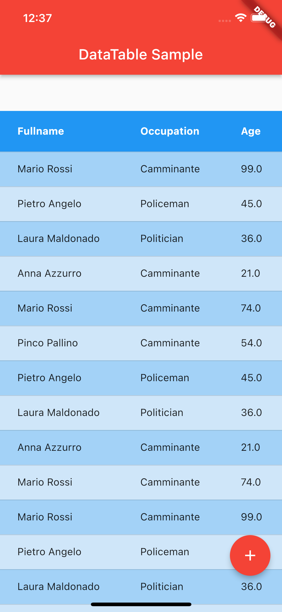

# sample DataTable

## Getting Started

For help getting started with Flutter development, view the online
[documentation](https://flutter.dev/).

For instructions integrating Flutter modules to your existing applications,
see the [add-to-app documentation](https://flutter.dev/docs/development/add-to-app).
